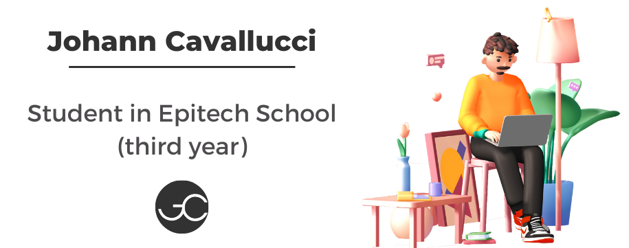

# Hey i'm Johann 👋

I'm a young **french** developer 🇫🇷 And i like to code in many languages like _C_, _C++_, _Python_, _Javascript_, _PHP_, _HTML_, _CSS_, _Dart_ _etc_...

In life I like to work on my **projects** 💻, watch **movies** 🎥 and **series** 📺, listen to **music** 🎵 and do **sport** 🏋️.

I am eager to learn and want to progress as much as possible! 🫶

## Languages and Tools 🛠️

----

                 

## My Actual Projects 📆

----
Currently I'm working on many projects like:
- My Application, with Flutter ( One landing page, with HTML, CSS and Javascript for this project ) 📱
- My portfolio website, with HTML, CSS javascript and Spline 📇
- And my projects for Epitech, with C++ and Python 🔌

## My Stats 📊

----

## Contact me 📨

----
#### You can contact me via [LinkedIn](https://www.linkedin.com/in/johann-cavallucci/) or [Instagram](https://www.instagram.com/johann.cvl/?hl=fr), [email](mailto:johann.cavallucci@epitech.eu)

----

